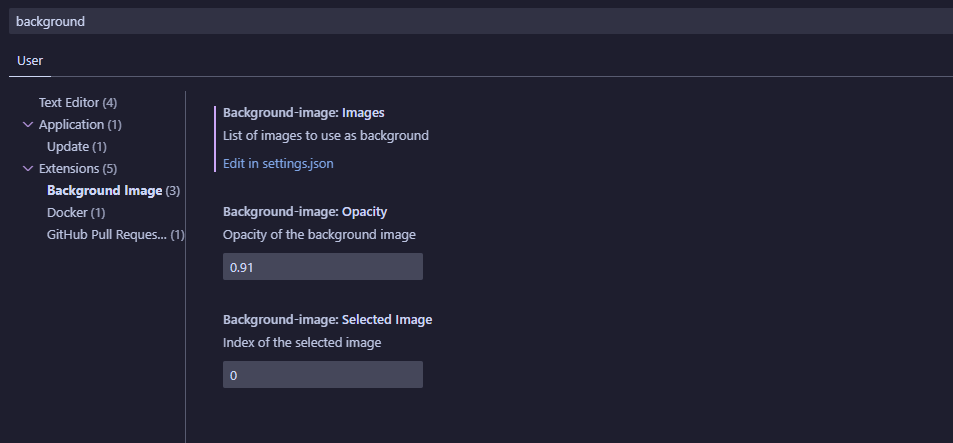

# Background Image

A fun simple background extension for vscode which allows users to manage their backgrounds with images. This extension allows for more creative Visual Studio Code editor designs.

This is made only for simple purposes so no advanced features have been though of nor a sheet of todos on this project. If any suggestions or issues notify us on our [Github](https://github.com/lukasolsen/background-image)

## Features

## 

## Requirements

- `Requires a VSCode version above 1.88.1`

## Extension Settings

- `background-image.images` - The list of images which you allow us to use.
- `background-image.selectedImage` - The current index of the array which includes images. For example to select the first image in the array have it as `0`
- `background-image.opacity` - The opacity of the image, default is `0.91`

## Issues

This project may include bugs or issues at all kinds of rates. If you have detected some sort of issue, notify us at our [Github Issues](https://github.com/lukasolsen/background-image/issues)

**Enjoy!**
